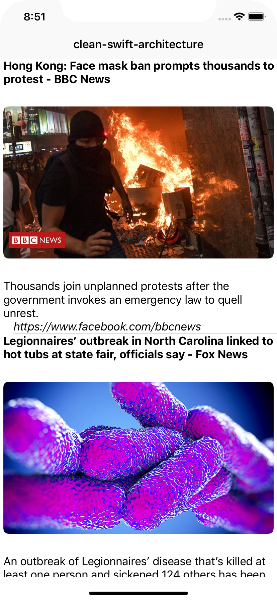

# pet-project: iOS Swift Clean Architecture 

## Libraries used:
1. Alamofire
2. ObjectMapper
3. Kingfisher

## For run:
1. Create API key from https://newsapi.org/
2. Put API key in the NewsListWorker.swift

### Screenshot:

